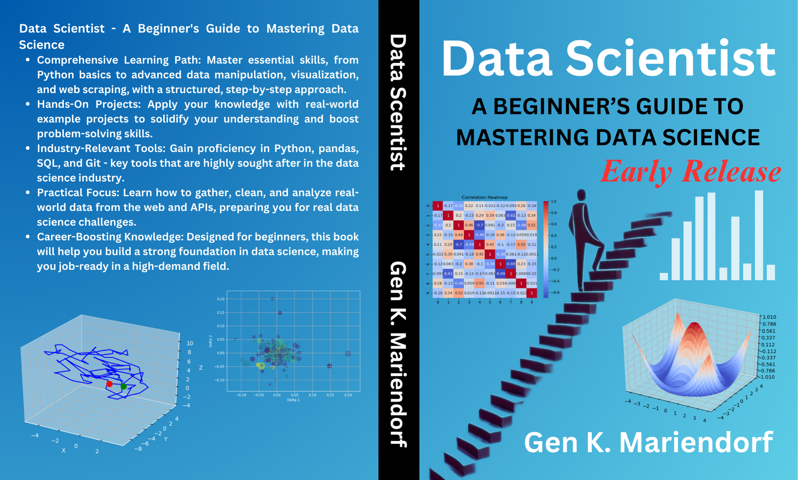

# Resource of Data Scientist (with Python): A Beginner's Guide to Mastering Data Science 



The book is available on Amazon.

* [Amazon.com - Data Scientist: A Beginner's Guide to Mastering Data Science](https://www.amazon.com/dp/B0DJYBC6JB?ref_=pe_93986420_774957520)

* [Amazon.de - Data Scientist: A Beginner's Guide to Mastering Data Science](https://www.amazon.de/dp/B0DJYBC6JB?ref_=pe_93986420_774957520)


All source codes we’ve provided in the book is available on the following GitHub URL and a branch ‘early-release’.
https://github.com/gen6scp/data_scientist_with_python_resource

For instance, you can locally copy all source codes by using the following Git command.

```
git clone -b early-release \
 https://github.com/gen6scp/data_scientist_with_python_resource.git
```

## Structure

Each chapter has an *outputs* directory symlinked to a *plots* directory. To regenerate outputs, you can run a script with a chapter name:

```
 run.sh chapter01
```

## Chapter 5

* [Red Wine Quality](https://github.com/aniruddhachoudhury/Red-Wine-Quality)

> Red Wine quality classification Model The two datasets are related to red and white variants of the Portuguese "Vinho Verde" wine. For more details, 
> consult the reference [Cortez et al., 2009]. 
> Due to privacy and logistic issues, only physicochemical (inputs) and sensory (the output) variables are available (e.g. there is no data about grape types, wine brand, wine selling price, etc.).
>

The '*winequality-red.csv*' file is originally given by the University of California, Irvine's Machine Learning repository.


## Chapter 7

* [UFO Sightings](https://corgis-edu.github.io/corgis/csv/ufo_sightings/)

This data includes >80,000 recorded UFO “sightings” around the world, including the UFO shape, lat/long and state/country of where the sighting occurred, duration of the “event” and the data_time when it occurred. We dropped some obvious empty rows in the file beforehand, as Panda could not read it as a CSV file.
